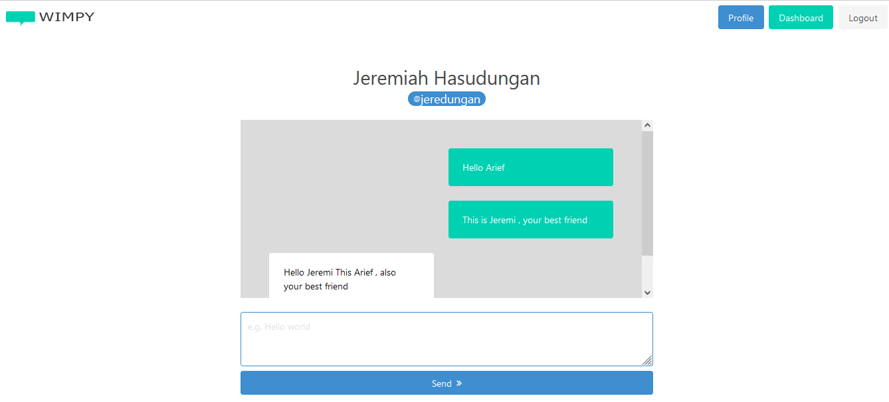

# Wimpy Chatty

This is an example of real-time chat application built with spring-boot using STOMP (Streaming Text Oriented Messaging Protocol) library.

## Run Local

To try this application on your locale :

```bash
git pull {githubtothisproject}

cd {projectdir}

mvn spring-boot:run
```

Make sure you already had JDK/JVM on your machine. Project should run at localhost at port 8081 by default. A dummy data will be injected. You can find dummy data sql in **/src/main/resources/data.sql**

## Project Utilty

* Register New Account
* Login To Account
* Search Friend
* Add New Friend
* Chat With Friend

## Try The Real Time Chat

To try the real time chat :

* Go to **register**, and register new account
* Open other browser, **a different browser**
* On second browser register a second browser
* On first browser , using first created account , go to **add new friend** and search your second account **account name**
* Now you can use the real time chat.
* To use injected dummy account you could see it on **/src/main/resources/data.sql**

## Database

This project already embedded H2 Database, so created data will lost upon restart.  You can change the DB configuration in application.properties :

```bash
# H2 Database Config
spring.datasource.url=jdbc:h2:mem:testdb
spring.datasource.driverClassName=org.h2.Driver
spring.datasource.username=sa
spring.datasource.password=password
spring.jpa.database-platform=org.hibernate.dialect.H2Dialect

# H2 GUI Config
spring.h2.console.enabled=true
spring.h2.console.path=/h2
spring.h2.console.settings.trace=false
```

If you using you own remote database, all table should creared automatically.

## Snapshot

Below is The snapshot of the application

Snapshot 1 :



Snapshot 2 :

